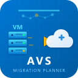

# AVS Migration Planner

  

**Azure VMware Solution Migration Planner with AI-Assisted Analysis** for Visual Studio Code.

> Turn weeks of Azure VMware Solution migration planning into minutes.

Planning an AVS migration today means weeks of spreadsheets — analyzing VM inventories, mapping to node types, estimating costs, planning network extensions, and writing Bicep templates from scratch. This extension does all of that inside VS Code.

## Why This Exists

| Without this extension | With this extension |
|----------------------|-------------------|
| Weeks of manual spreadsheet analysis | **Minutes** — import CSV, get instant results |
| Guessing at node types and cluster sizes | **Data-driven** — fit-score algorithm across 5 node types |
| Outdated pricing from old proposals | **Live pricing** from Azure Retail Prices API |
| Hand-writing Bicep templates | **Auto-generated** Bicep with ExpressRoute + NSX-T segments |
| Migration waves planned on whiteboards | **Smart wave planner** with dependency grouping and risk scoring |
| No way to ask "what if" questions | **AI-assisted** — `@avs` in Copilot Chat for instant expert analysis |

## Quick Start

1. **Install** the extension from the VS Code Marketplace
2. **Import** your VM inventory: `Ctrl+Shift+P` → `AVS: Import VM Inventory`
3. **View** the dashboard: `Ctrl+Shift+P` → `AVS: Open Migration Dashboard`
4. **Ask AI**: Open Copilot Chat → type `@avs /analyze`

That's it. You'll see node recommendations, cost comparisons, migration waves, and network extension plans — all in seconds.

<!-- Screenshot: Full dashboard after importing a VM inventory -->
<!-- Replace with your own screenshot: save to docs/images/dashboard.png -->

## What You Get

### 1. Import Any VM Inventory
Drop in your RVTools export or any CSV with VM data. The parser auto-detects the format.

- **RVTools** — Direct import from vInfo tab CSV exports (Network #1 through #4 supported)
- **Standard CSV** — Works with any CSV that has name, vCPUs, memory, storage columns
- **EU locales** — Semicolon-delimited CSVs detected automatically
- **Validation** — Warnings for missing data, unit conversion (MB→GB), power state normalization

<!-- Screenshot: Import notification showing VM count and best-fit recommendation -->
<!-- Replace with your own screenshot: save to docs/images/import.png -->

### 2. AVS Node Sizing (Gen 1 + Gen 2)
Analyzes your total CPU, memory, and storage needs (with configurable overhead buffers) and recommends the best-fit node type across all available SKUs.

Sizing uses the same methodology as the **AVS License Calculator v4.04**:

- **CPU**: Physical cores × configurable overcommit ratio (default **4:1** for production, up to 8:1 for dev/test)
- **Memory**: Physical RAM × overcommit ratio × (1 − 10% vSphere overhead)
- **Storage**: Raw capacity ÷ FTT policy overhead × (1 − 25% vSAN slack) × dedup/compression ratio
- **N+1 HA**: One extra node automatically added for host failure tolerance
- **Driving dimension**: Reports whether CPU, Memory, or Storage is the binding constraint

**Usable capacity per node** (default config: 4:1 CPU, 1:1 memory, FTT=1 EC, 1.8× dedup, 25% slack):

| Node | Cores | Usable vCPUs | RAM | Usable RAM | Raw Storage | Usable Storage | Disks |
|------|-------|-------------|-----|-----------|-------------|----------------|-------|
| AV36 | 36 | 144 | 576 GB | 518 GB | 15.36 TB | 15.59 TB | 8×1920 GB |
| AV36P | 36 | 144 | 768 GB | 691 GB | 19.20 TB | 19.49 TB | 6×3200 GB |
| AV52 | 52 | 208 | 1,536 GB | 1,382 GB | 38.40 TB | 38.98 TB | 6×6400 GB |
| AV48 | 48 | 192 | 1,024 GB | 922 GB | 25.60 TB | 25.98 TB | 8×3200 GB |
| AV64 | 64 | 256 | 1,024 GB | 922 GB | 21.12 TB | 21.44 TB | 11×1920 GB |

All sizing parameters are configurable via the `SizingConfig` interface. Disk-level specs sourced from the [AVS Calculator v4.04 SkuList](https://github.com/KimVaddi/avs-migration-planner).

> **Note:** AV48 and AV64 (Gen 2) are only available in [select Azure regions](#regional-availability). The extension's regional availability matrix will warn you if a Gen 2 node is not available in your target region.

### 3. Live Cost Estimates & Multi-Year TCO
Pricing fetched in real-time from the [Azure Retail Prices API](https://prices.azure.com) (no authentication needed). Falls back to reference estimates when offline.

- **Pay-As-You-Go** vs **1-Year RI** vs **3-Year RI** — side by side
- **Multi-year TCO** — 1 to 5-year consumption plan with yearly breakdown
- **Microsoft Defender for Servers** Plan 2 cost per VM ($14.60/mo default)
- **Microsoft Defender for SQL** cost per DB server ($15.00/mo default)
- **Custom discounts** — Apply EA/CSP negotiated RI or PAYG discount rates
- **SQL VM detection** — Automatically identifies SQL/DB VMs by name pattern for Defender cost modeling
- Savings percentages calculated for each commitment tier
- All 5 node types compared in one view
- Region-configurable via VS Code settings

> **Important:** Pricing is approximate. Always verify with the [Azure Pricing Calculator](https://azure.microsoft.com/pricing/calculator/) and your Microsoft account team for Reserved Instance quotes.

### 4. Migration Wave Planner
Groups your VMs into migration waves using a smart 3-tier strategy:

1. **Explicit dependencies** — VMs tagged with the same dependency group stay together
2. **Network affinity** — VMs sharing the same VLAN are grouped automatically (no tagging needed)
3. **Tier ordering** — Infrastructure migrates first, then databases, then apps, then web frontends

Each wave includes:
- Risk level (Low / Medium / High)
- Estimated duration based on [HCX 4.10 documented throughput](https://configmax.broadcom.com/) (100 GB/hr default for 1 Gbps ExpressRoute, with 2-hour switchover buffer)
- Required network extensions
- Sequential scheduling with configurable gaps between waves

Export as **CSV** (for Excel/project management) or **text report**.

### 5. HCX Configuration Generator
Auto-generates VMware HCX mobility groups and network extensions from your wave plan:

- One mobility group per wave per network
- Migration type auto-selected: Bulk (parallel) for large groups, vMotion (zero-downtime) for small groups
- Network extension tracking with per-wave dependencies
- Export as **JSON** (for automation) or **text report**

### 6. Bicep Template Generator
Produces deployment-ready Bicep templates for your AVS private cloud:

- **Private Cloud** resource with correct SKU and cluster size
- **ExpressRoute Global Reach** peering (optional)
- **NSX-T workload segments** with configurable base CIDR (warns about IP conflicts)
- **Multi-cluster** support for large deployments
- **Internet access** toggle (Enabled/Disabled)
- Parameters file included — ready for `az deployment group create`

### 7. AI-Assisted Mode (`@avs` in Copilot Chat)
Ask questions about your migration using natural language. The AI sees your actual imported data — not generic advice.

<!-- Screenshot: @avs /analyze in Copilot Chat -->
<!-- Replace with your own screenshot: save to docs/images/ai-chat.png -->

| Command | What you get |
|---------|-------------|
| `@avs /analyze` | Executive summary, workload characterization, complexity rating, top risks |
| `@avs /recommend` | Architecture advice — SKU rationale, storage strategy, ExpressRoute sizing |
| `@avs /risk` | Per-wave risk register with likelihood, impact, and mitigation |
| `@avs /optimize` | Cost optimization — RI break-even, right-sizing, decommission candidates |
| `@avs /explain` | Plain-language summary for project managers and stakeholders |
| `@avs Why AV36P over AV52?` | Freeform questions answered with your specific data |

Requires **GitHub Copilot subscription** and **VS Code 1.93+**.

### 8. Interactive Dashboard
A full-page HTML dashboard with:

<!-- Screenshot: Dashboard with metrics, cost table, wave plan -->
<!-- Replace with your own screenshot: save to docs/images/dashboard-detail.png -->

- Visual metric cards (VMs, vCPUs, memory, storage, networks)
- OS distribution breakdown
- Node recommendation comparison table with fit scores
- Cost comparison with savings highlights
- Migration wave timeline with per-wave VM lists and risk badges
- Network extension summary

### 9. Excel Report Export (.xlsx)
Generates a professional, multi-sheet Excel workbook ready for stakeholder delivery:

| Sheet | Content |
|-------|--------|
| **Input Fields** | Sizing config (overcommit, FTT, dedup, slack), workload summary, required resources |
| **Node Sizing** | All 5 node types with utilization %, fit score, driving dimension, cluster layout. Best fit highlighted in green. |
| **Pricing & Cost** | PAYG / 1yr RI / 3yr RI per node type. Currency-formatted with savings %. |
| **VM Inventory** | Full VM list with auto-filter, SQL/DB detection, power-state color coding. |
| **Wave Plan** | Every VM mapped to its migration wave with risk levels, day offsets, durations. |
| **SKU Reference** | Hardware specs for all 5 AVS node types with pricing. |

Uses the `exceljs` library. Command: `AVS: Export Excel Report (.xlsx)`.

## All Commands

| Command | Description |
|---------|-------------|
| `AVS: Import VM Inventory (CSV/RVTools)` | Import and analyze a VM inventory |
| `AVS: Open Migration Dashboard` | Full visual dashboard in a new tab |
| `AVS: Generate Bicep Templates` | Interactive Bicep generator with prompts |
| `AVS: Generate HCX Configuration` | Export HCX config as JSON or text |
| `AVS: Generate Migration Wave Plan` | Export waves as CSV (Excel) or text |
| `AVS: Export Full Migration Report` | Everything in one Markdown/text file |
| `AVS: Export Excel Report (.xlsx)` | Professional 6-sheet Excel workbook |

## Settings

Configure in VS Code Settings (`Ctrl+,`) under **AVS Migration Planner**:

| Setting | Default | Description |
|---------|---------|-------------|
| `wave.maxVMsPerWave` | 25 | Max VMs per migration wave |
| `wave.maxVCPUsPerWave` | 200 | Max vCPUs per wave |
| `wave.maxStoragePerWaveGB` | 5000 | Max storage (GB) per wave |
| `wave.daysBetweenWaves` | 3 | Days between wave start dates |
| `wave.throughputGBPerHour` | 100 | HCX throughput (100 for 1Gbps ER, 500+ for 10Gbps) |
| `pricing.region` | eastus | Azure region for pricing lookup |

## Supported CSV Formats

### RVTools Export
Export the **vInfo** tab from RVTools as CSV. The extension reads these columns:
- `VM`, `Powerstate`, `CPUs`, `Memory MB`, `Provisioned MB`, `Datacenter`, `Cluster`, `Host`
- `Network #1`, `Network #2`, `Network #3`, `Network #4` (all NICs parsed)
- `Annotation` (used as dependency group if present)

### Standard CSV
Any CSV with these column headers (flexible naming):
- `name`, `vcpus`, `memory_gb`, `storage_gb`, `os`, `power_state`
- `datacenter`, `cluster`, `host`, `network`, `dependency_group`

### Semicolon-Delimited
EU-locale CSVs using `;` as delimiter are auto-detected. No configuration needed.

## Who Is This For?

- **Cloud architects** planning AVS migrations from on-premises VMware
- **Pre-sales engineers** building AVS proposals and cost estimates
- **Migration project managers** creating wave plans and schedules
- **Infrastructure teams** generating Bicep templates for AVS deployment
- **Anyone** with an RVTools export who needs to answer "how much will AVS cost?"

## Requirements

- **VS Code** 1.93.0 or later
- **VM inventory** in CSV format (RVTools export recommended)
- **GitHub Copilot** subscription (for `@avs` AI-assisted commands — optional)
- **Internet access** (for live pricing from prices.azure.com — works offline with fallback estimates)

## Data & Privacy

- **No data leaves your machine** except one HTTPS call to `prices.azure.com` for pricing (a public API, no auth)
- Your VM inventory is never uploaded anywhere
- AI-assisted mode sends migration summary data to GitHub Copilot (same as any Copilot Chat interaction)
- No telemetry, no tracking, no analytics

## Regional Availability

The extension includes a 37-region AVS availability matrix (sourced from the AVS Calculator v4.04):

- **Gen 1 nodes** (AV36, AV36P, AV52) — available in all AVS regions
- **Gen 2 nodes** (AV48, AV64) — available in: US East, EU North, CA Central, CA East, UK West, CH West, BE Central
- **Stretched clusters** — supported in: US East, UK South, AU East, DE West Central, EU West

Use `getAvailableNodeTypes(region)` to check which node types are available in your target region.

## Release Notes

### 1.1.0
- **Excel report export** — Professional 6-sheet `.xlsx` workbook (Input Fields, Node Sizing, Pricing & Cost, VM Inventory, Wave Plan, SKU Reference) with formatting, auto-filter, and color coding
- **Sizing engine overhaul** — vSAN storage formula with configurable FTT policy, dedup/compression, and slack space (replaces flat 35% multiplier)
- **CPU overcommit ratios** — configurable 4:1 (production) or 8:1 (dev/test) instead of HT-based calculation
- **Memory overcommit** — configurable ratio with explicit vSphere 10% overhead
- **N+1 HA policy** — automatically adds one spare node for host failure tolerance
- **Driving dimension** — reports whether CPU, Memory, or Storage is the binding constraint
- **AV64 specs corrected** — raw storage fixed from 15.36 TB to 21.12 TB (11×1920 GB Gen 2)
- **Multi-year TCO** — 1 to 5-year consumption plans with yearly cost breakdown
- **Defender for Servers/SQL** — cost modeling for Microsoft Defender ($14.60/VM/mo, $15.00/DB/mo)
- **Custom discounts** — EA/CSP negotiated RI and PAYG discount rates
- **SQL VM detection** — automatic identification of SQL/DB VMs by name pattern
- **Regional availability matrix** — 37 regions with Gen 2 and stretched cluster support flags
- **ARM region mapping** — bidirectional ARM-to-display region name lookup
- **SizingConfig interface** — all sizing parameters configurable (overcommit, dedup, FTT, slack, HA)
- Disk-level specs (count, size) added to all node types
- 178 unit tests (was 130)

### 1.0.0
- RVTools and standard CSV import with auto-detection and EU semicolon support
- AVS node sizing across 5 types: AV36, AV36P, AV52 (Gen 1), AV48, AV64 (Gen 2)
- Live pricing from Azure Retail Prices API with offline fallback
- Cost comparison: Pay-As-You-Go, 1-Year RI, 3-Year RI
- Smart wave planner: dependency grouping → network affinity → tier ordering
- HCX mobility group and network extension generator
- Bicep templates: Private Cloud, ExpressRoute Global Reach, NSX-T segments
- Interactive HTML dashboard
- AI-assisted mode via `@avs` Copilot Chat participant
- Configurable wave limits and throughput via VS Code settings
- Session state persistence across VS Code restarts
- Save As dialogs for all exports (CSV, JSON, Markdown)

## License

[MIT](LICENSE)

## Contributing

Issues and pull requests welcome at [github.com/kimvaddi/avs-migration-planner](https://github.com/kimvaddi/avs-migration-planner).
